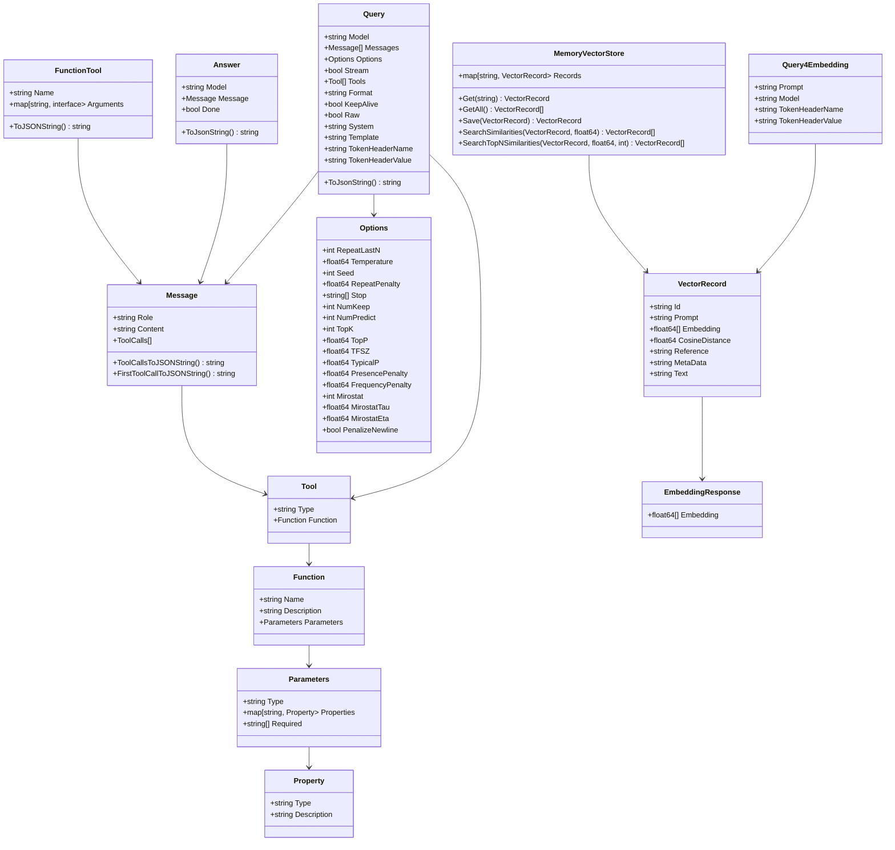

# GoLlama

**GoLlama** is a very simple library to interact with the Ollama API. (It's a wrapper around the Ollama API + some helper functions)

> GoLlama was developed for the preparation of a presentation at DevFest Toulouse 2024. 

## Features

- Chat completion
- Embedding
- Tools

